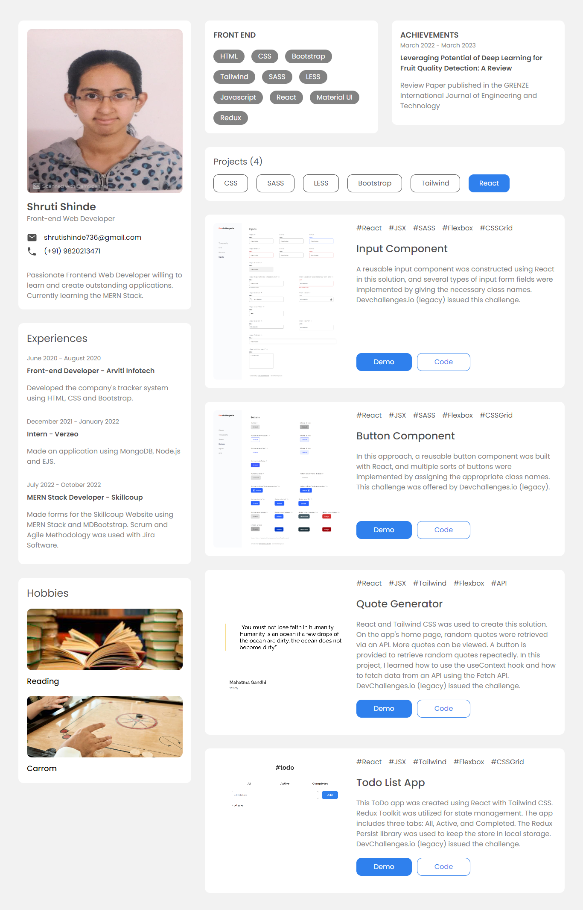

<h1 align="center">Portfolio Website</h1>

<div align="center">
   Solution for a challenge from  <a href="http://legacy.devchallenges.io" target="_blank">Devchallenges.io (legacy)</a>.
</div>

<div align="center">
  <h3>
    <a href="https://portfolio-devchallenges-henna.vercel.app/">
      Demo
    </a>
    <span> | </span>
    <a href="https://github.com/ShrutiShinde418/portfolio-devchallenges">
      Solution
    </a>
    <span> | </span>
    <a href="https://legacy.devchallenges.io/challenges/5ZnOYsSXM24JWnCsNFlt">
      Challenge
    </a>
  </h3>
</div>

<!-- TABLE OF CONTENTS -->

## Table of Contents

- [Table of Contents](#table-of-contents)
- [Overview](#overview)
- [My process](#my-process)
  - [Built With](#built-with)
  - [What I learned](#what-i-learned)
  - [Continued development](#continued-development)
- [Features](#features)
- [How To Use](#how-to-use)
- [Acknowledgements](#acknowledgements)
- [Contact](#contact)

<!-- OVERVIEW -->

## Overview



## My process

### Built With

- [React](https://reactjs.org/)
- [Tailwind](https://tailwindcss.com/)
- React Context API

### What I learned

- React Context API
- How to make tabs

### Continued development

- React Context API

## Features

This application/site was created as a submission to a [DevChallenges](https://legacy.devchallenges.io/paths/front-end-developer) challenge. The [challenge](https://legacy.devchallenges.io/challenges/hH6PbOHBdPm6otzw2De5) was to build an application to complete the given user stories.

## How To Use

To clone and run this application, you'll need [Git](https://git-scm.com) and [Node.js](https://nodejs.org/en/download/) (which comes with [npm](http://npmjs.com)) installed on your computer. From your command line:

```bash
# Clone this repository
$ git clone https://github.com/ShrutiShinde418/portfolio-devchallenges

# Install dependencies
$ npm install

# Run the app
$ npm start
```

## Contact

- GitHub [@ShrutiShinde418](https://github.com/ShrutiShinde418)
- Website - [Portfolio](https://portfolio-devchallenges-henna.vercel.app/)
- Frontend Mentor - [@ShrutiShinde418](https://www.frontendmentor.io/profile/ShrutiShinde418)
